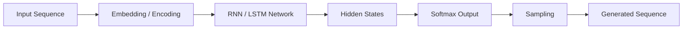
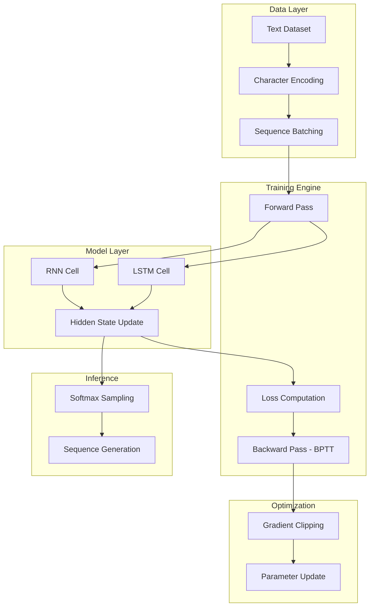

# RNN, LSTM, and Character-Level Language Modeling (NumPy)

A deep learning project that implements Recurrent Neural Networks (RNNs) and Long Short-Term Memory (LSTM) networks from scratch using NumPy. The system performs character-level language modeling to generate sequences such as dinosaur names through probabilistic sampling.

---

## Overview

This repository demonstrates how sequence models learn temporal dependencies using hidden states and gating mechanisms. It covers full forward and backward propagation (BPTT), gradient clipping, and sampling for sequence generation.

---

## Features

- End-to-end RNN and LSTM implementation from scratch  
- Character-level language modeling for sequence generation  
- Forward and backward propagation with BPTT  
- Gradient clipping for stable training  
- Softmax-based sampling for text generation  
- Modular and educational implementation  

---

## Model & Framework

- **Model**: RNN & LSTM (from scratch)  
- **Framework**: Python 3.x / NumPy  
- **Task**: Sequence modeling & character-level generation  
- **Input**: Text sequences (e.g., `dinos.txt`)  
- **Output**: Generated character sequences  

---

## System Architecture

### High-Level Pipeline

## Core Components

### Forward Pass
- `rnn_cell_forward()`, `rnn_forward()`  
- `lstm_cell_forward()`, `lstm_forward()`  

### Backward Pass
- `rnn_cell_backward()`, `rnn_backward()`  
- `lstm_cell_backward()`, `lstm_backward()`  

### Utilities
- `clip()` → Gradient clipping  
- `sample()` → Sequence generation  
- `optimize()` → Parameter updates  
- `model()` → Training loop  

---

## Training & Sampling

- Full training loop with forward and backward propagation  
- Gradient clipping to prevent exploding gradients  
- Loss smoothing using exponential moving average  
- Input sequences shuffled across epochs  
- Periodic sampling to generate sequences  

---

## Workflow

1. Load and preprocess text dataset  
2. Convert characters to one-hot encodings  
3. Initialize RNN/LSTM parameters  
4. Perform forward propagation  
5. Compute loss  
6. Backpropagate through time (BPTT)  
7. Apply gradient clipping  
8. Update parameters  
9. Generate sequences via sampling  

---

## Sample Outputs

- `a[4][3][6] = 0.2197`  
- `c[1][2][1] = -0.2219`  
- `gradients["dWax"].shape = (5,3)`  
- `gradients["dWc"].shape = (5,8)`  
- Sampled sequence: `toranozaur`  

---

## Results & Outputs

- Generated character sequences  
- Loss reduction across iterations  
- Stable training via gradient clipping  
- Learned temporal dependencies  

---

## Dependencies

- Python 3.x  
- NumPy  

---

## Design Principles

- From-scratch implementation for deep understanding  
- Explicit forward and backward computations  
- Modular and reusable architecture  
- Educational focus on sequence modeling  

---

## License

This project is intended for educational and research purposes.  
Free to use and modify with proper attribution.
